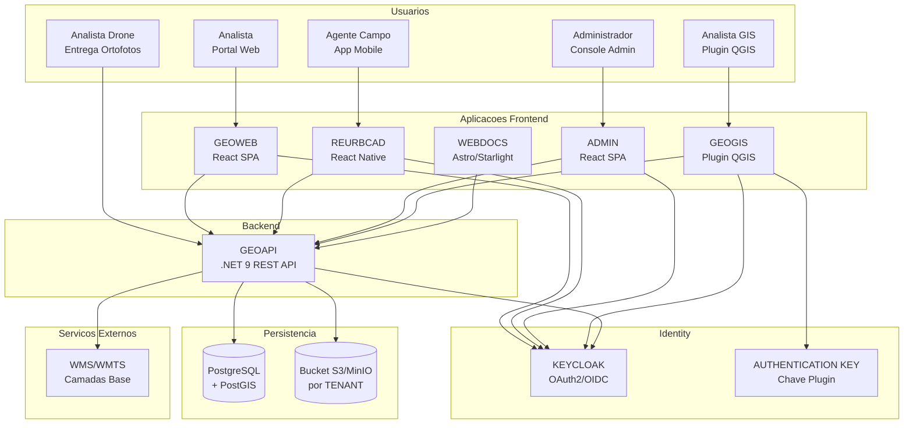

# Ecossistema CARF

Visao geral de todos os sistemas do ecossistema CARF e suas conexoes, mostrando como usuarios interagem com aplicacoes frontend que consomem o backend central e servicos de autenticacao. O Plugin QGIS (GEOGIS) exige autenticacao em duas etapas via Keycloak OAuth2 seguido de AUTHENTICATION KEY.

