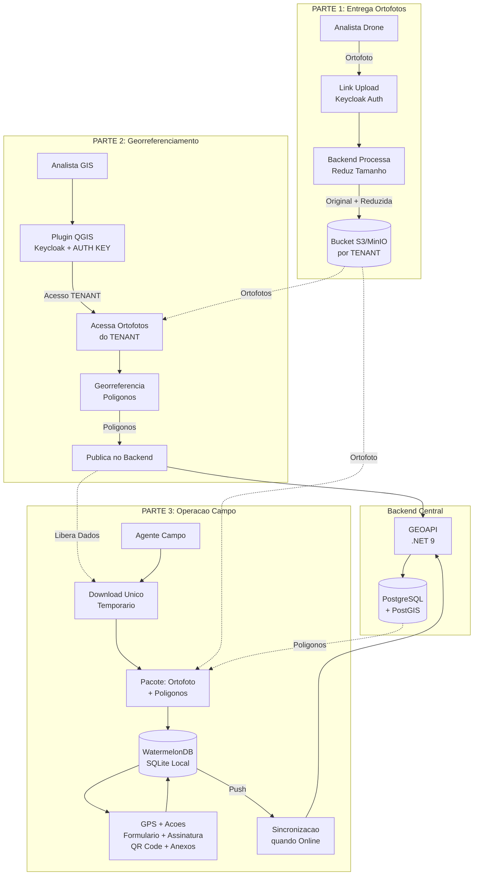

# Fluxo de Dados

Ilustra como dados fluem entre sistemas seguindo as tres partes do workflow: entrega de ortofotos pelo Analista de Drone, georreferenciamento e publicacao pelo Analista GIS, e operacao em campo pelo Agente com sincronizacao offline.

