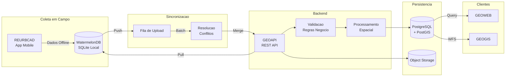

# Fluxo de Dados

Ilustra como dados fluem entre sistemas desde a coleta em campo ate a persistencia no banco, incluindo sincronizacao offline e processamento pelo backend.

```mermaid
flowchart LR
    subgraph Campo["Coleta em Campo"]
        Mobile["REURBCAD<br/>App Mobile"]
        LocalDB[("WatermelonDB<br/>SQLite Local")]
    end

    subgraph Sync["Sincronizacao"]
        Queue["Fila de Upload"]
        Conflict["Resolucao<br/>Conflitos"]
    end

    subgraph API["Backend"]
        GEOAPI["GEOAPI<br/>REST API"]
        Validation["Validacao<br/>Regras Negocio"]
        Spatial["Processamento<br/>Espacial"]
    end

    subgraph Storage["Persistencia"]
        POSTGRES[("PostgreSQL<br/>+ PostGIS")]
        Files[("Object Storage")]
    end

    subgraph Clients["Clientes"]
        GEOWEB["GEOWEB"]
        GEOGIS["GEOGIS"]
    end

    Mobile -->|"Dados Offline"| LocalDB
    LocalDB -->|"Push"| Queue
    Queue -->|"Batch"| Conflict
    Conflict -->|"Merge"| GEOAPI

    GEOAPI -->|"Pull"| LocalDB

    GEOAPI --> Validation
    Validation --> Spatial
    Spatial --> POSTGRES
    GEOAPI --> Files

    POSTGRES -->|"Query"| GEOWEB
    POSTGRES -->|"WFS"| GEOGIS
```
