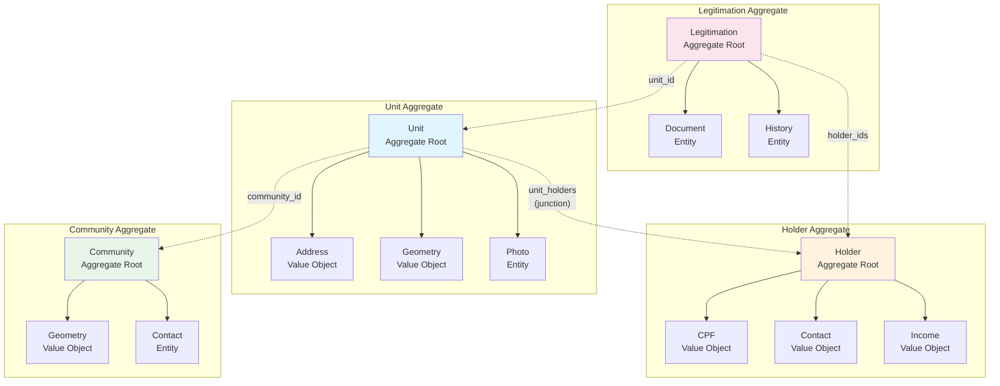

# Aggregates Diagram

Diagrama dos aggregates e seus relacionamentos no modelo de domínio CARF.

## Diagrama Mermaid

## Regras de Aggregate

### Unit Aggregate
- **Aggregate Root**: Unit
- **Boundary**: Unit, Address, Geometry, Photos
- **Invariantes**:
  - Geometria deve ser polígono válido
  - Área > 0
  - Status só avança via eventos de workflow

### Holder Aggregate
- **Aggregate Root**: Holder
- **Boundary**: Holder, CPF, Contact, Income
- **Invariantes**:
  - CPF único por tenant
  - Idade >= 18 anos

### Community Aggregate
- **Aggregate Root**: Community
- **Boundary**: Community, Geometry, Contacts
- **Invariantes**:
  - Nome único por tenant
  - Geometria não sobrepõe outras comunidades

### Legitimation Aggregate
- **Aggregate Root**: Legitimation (Process)
- **Boundary**: Process, Documents, History
- **Invariantes**:
  - Workflow state machine válido
  - Documentos obrigatórios presentes antes de aprovação

## Notas

- Referências entre aggregates são por ID apenas
- Tabela `unit_holders` é junction table, não pertence a nenhum aggregate
- Cada aggregate é boundary de transação
- Multi-tenancy aplicado em todos aggregates via TenantId

---

**Última atualização:** 2026-01-16
**Status do arquivo**: Review
