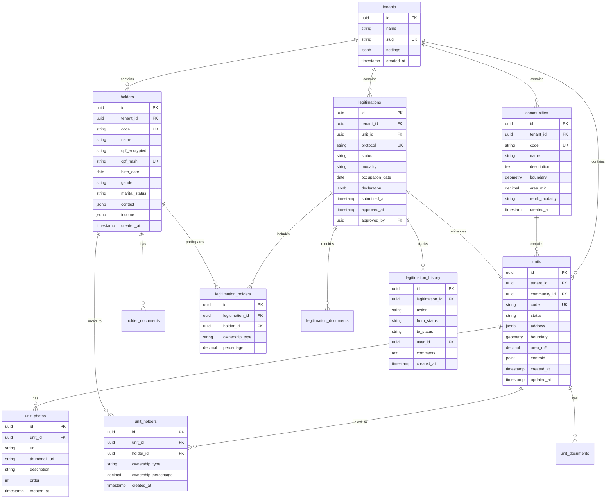

# ER Diagram

Diagrama Entity-Relationship do banco de dados CARF.

## Diagrama Mermaid



## Constraints Principais

### Primary Keys
- Todas as tabelas usam UUID como PK
- Gerados via `gen_random_uuid()`

### Foreign Keys
- `tenant_id` em todas tabelas principais (RLS)
- `ON DELETE RESTRICT` para preservar integridade
- Índices em todas FKs

### Unique Constraints
- `tenants.slug`
- `communities.code` (per tenant - compound)
- `units.code` (per tenant)
- `holders.cpf_hash` (per tenant)
- `legitimations.protocol` (per tenant)

### Check Constraints
- `units.status IN ('Rascunho', 'Pendente', 'Aprovado', 'Rejeitado')`
- `unit_holders.ownership_percentage BETWEEN 0 AND 100`
- `legitimations.modality IN ('REURB-S', 'REURB-E')`

## Índices Geoespaciais

```sql
CREATE INDEX idx_units_boundary ON units USING GIST(boundary);
CREATE INDEX idx_units_centroid ON units USING GIST(centroid);
CREATE INDEX idx_communities_boundary ON communities USING GIST(boundary);
```

---

**Última atualização:** 2026-01-16
**Status do arquivo**: Pronto
