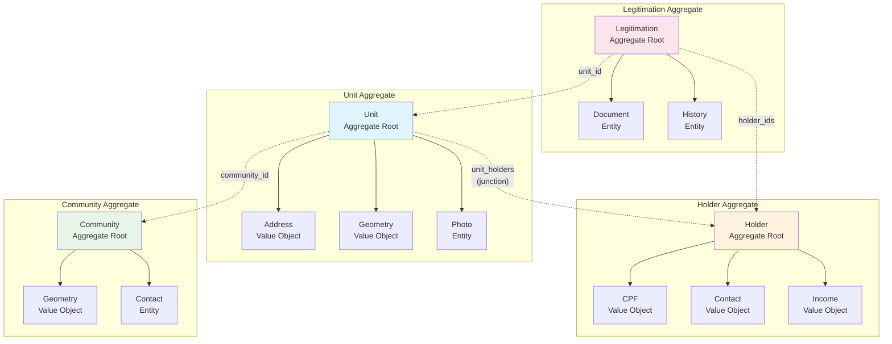

> **REVIEW**: Tipo diagram nao tem template definido. Arquivo usa multiplas H2s e bloco de codigo Mermaid.

# Aggregates Diagram

Diagrama dos aggregates e seus relacionamentos no modelo de dominio CARF, seguindo padroes de Domain-Driven Design.

## Diagrama Mermaid

## Regras de Aggregate

Cada aggregate possui invariantes que devem ser mantidas. Unit exige geometria valida e area maior que zero. Holder requer CPF unico por tenant e idade minima de 18 anos. Community precisa de nome unico por tenant e geometria que nao sobreponha outras comunidades. Legitimation segue state machine de workflow e exige documentos obrigatorios antes da aprovacao.

Referencias entre aggregates sao por ID apenas. Tabela unit_holders e junction table que nao pertence a nenhum aggregate. Cada aggregate e boundary de transacao. Multi-tenancy aplicado em todos via TenantId com RLS.
