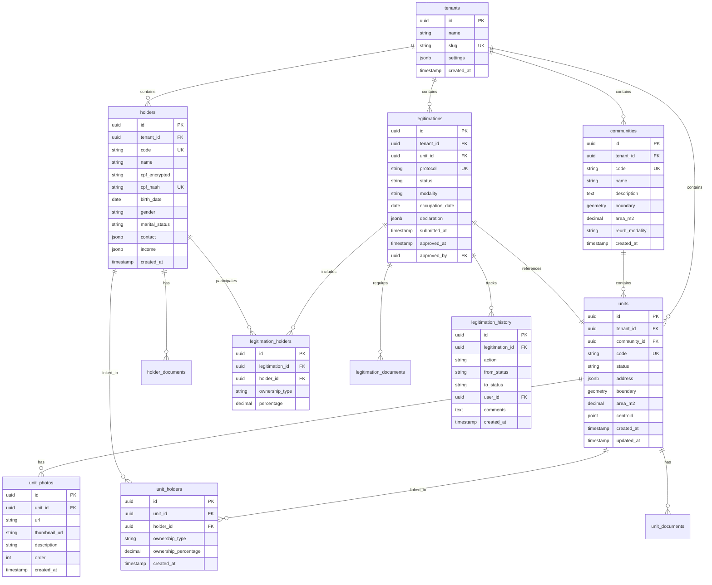

> **REVIEW**: Tipo diagram nao tem template definido. Arquivo usa multiplas H2s e bloco de codigo Mermaid.

# ER Diagram

Diagrama Entity-Relationship do banco de dados CARF com PostgreSQL e PostGIS para dados geoespaciais.

## Diagrama Mermaid

## Constraints

Todas as tabelas usam UUID como PK gerados via gen_random_uuid(). Foreign keys com ON DELETE RESTRICT preservam integridade. Unique constraints garantem unicidade de tenants.slug, communities.code, units.code, holders.cpf_hash e legitimations.protocol (todos por tenant).

Check constraints validam units.status IN ('Rascunho', 'Pendente', 'EmAnalise', 'Aprovado', 'Rejeitado', 'RequerAlteracoes'), unit_holders.ownership_percentage BETWEEN 0 AND 100, e legitimations.modality IN ('REURB-S', 'REURB-E').

Indices geoespaciais GIST em units.boundary, units.centroid e communities.boundary para queries espaciais performaticas.
