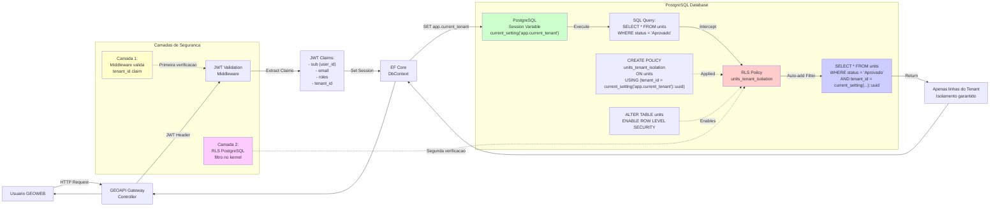

# Multi-Tenancy Diagram

Diagrama do fluxo de isolamento multi-tenant via JWT e Row-Level Security no PostgreSQL, demonstrando as camadas de seguranca defense-in-depth.

## Diagrama Mermaid

Arquitetura defense-in-depth com duas camadas de protecao. Middleware valida token JWT e extrai tenant_id dos claims. PostgreSQL RLS aplica filtro automatico em todas as queries, impossibilitando vazamento de dados entre tenants mesmo em caso de SQL injection.
