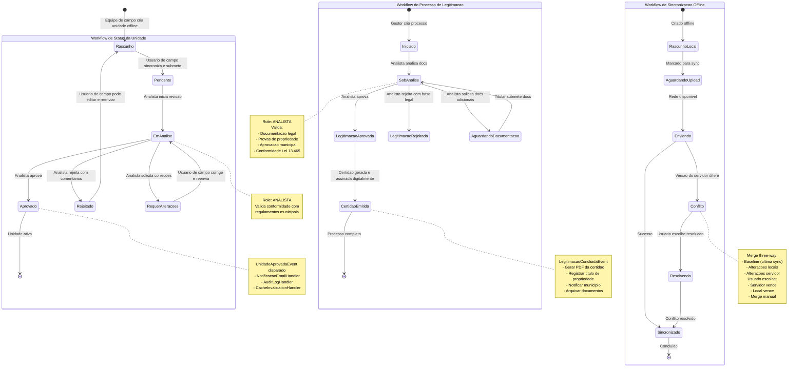

# Workflows Diagram

Diagramas de state machine para os workflows principais do sistema: status de Unit, processo de Legitimacao e sincronizacao offline.

## Diagrama Mermaid

Os workflows seguem o WORKFLOW-MESTRE do CARF. A equipe de campo (Coordenador e Cadastrador) cria unidades offline que sincronizam com o backend. O Analista (via Plugin QGIS ou GEOWEB) revisa e aprova. O processo de Legitimacao segue rito legal da Lei 13.465/2017 com etapas obrigatorias.
