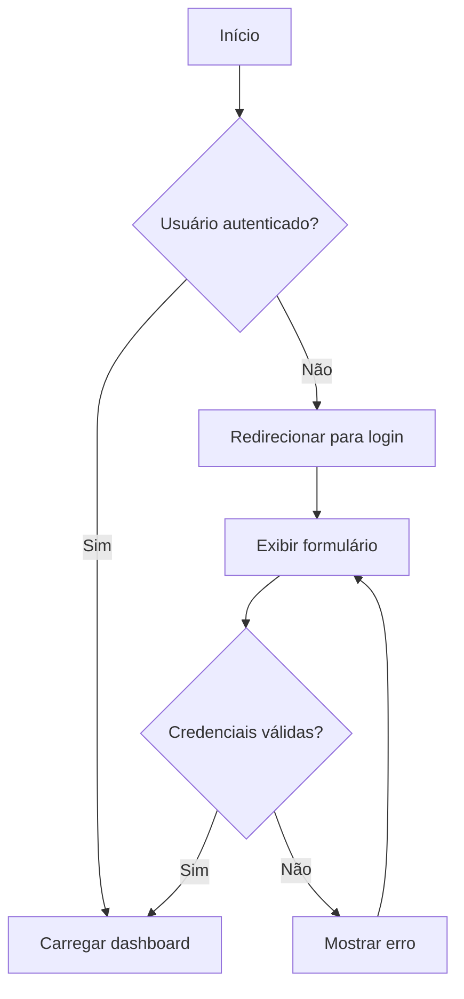
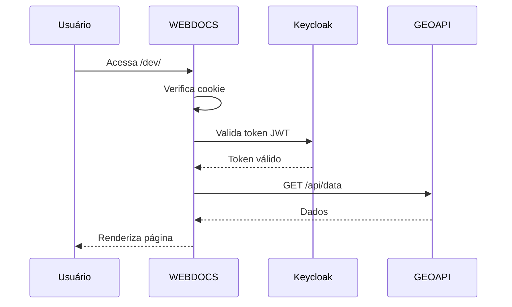
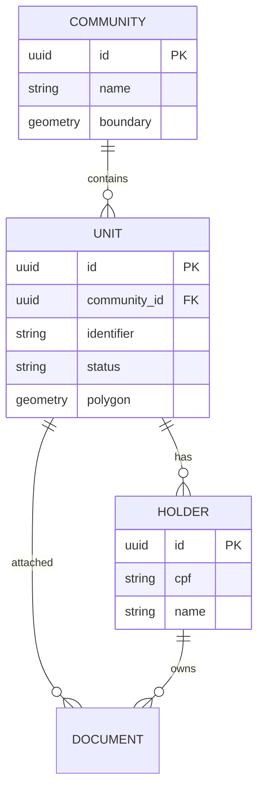
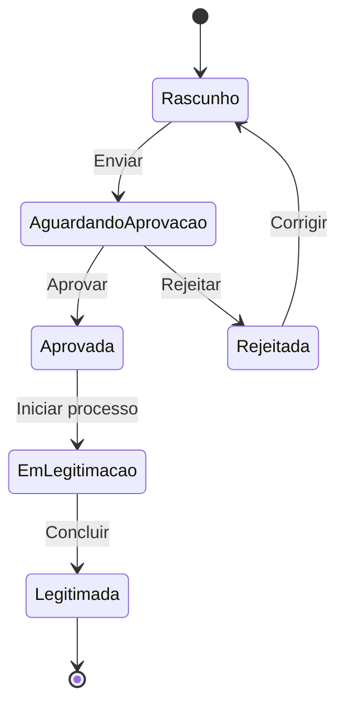
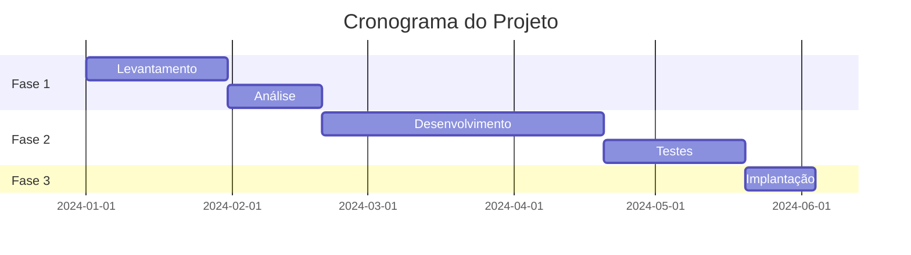

# Criar Diagrama

Guia para criar diagramas usando sintaxe Mermaid em documentos Markdown.

Mermaid permite criar diagramas a partir de texto que é renderizado como SVG no build. Preferir Mermaid quando possível pois texto é pesquisável, versionável, e facilmente atualizável comparado a imagens.

Flowchart para fluxos de processo usa sintaxe graph TD (top-down) ou graph LR (left-right) seguido de definições de nós e conexões. Nós são definidos com ID e label entre colchetes para retângulos ou parênteses para arredondados. Setas conectam nós com texto opcional.

Sequence diagram para interações entre componentes usa sintaxe sequenceDiagram seguido de participant para definir atores e setas para mensagens. Útil para documentar fluxos de autenticação, chamadas de API, e comunicação entre serviços.

ER diagram para modelo de dados usa sintaxe erDiagram com entidades contendo atributos e relacionamentos usando notação de cardinalidade. Útil para documentar schema do banco de dados e relacionamentos entre entidades.

Incluir diagrama em documento usando code block com linguagem mermaid. Plugin Astro processa durante build convertendo para SVG inline. Diagrama é renderizado no HTML final sem JavaScript client-side.

Testar diagrama localmente verificando renderização no navegador. Erros de sintaxe são reportados no console do servidor de desenvolvimento. Mermaid Live Editor online ajuda a prototipar diagramas antes de incluir no documento.

Tema do diagrama segue configuração global em astro.config.mjs que aplica cores do design system CARF. Dark mode usa variantes escuras automaticamente.

## Exemplos de Sintaxe

### Flowchart (Fluxo de Processo)

```markdown

```

### Sequence Diagram (Interação entre Componentes)

```markdown

```

### ER Diagram (Modelo de Dados)

```markdown

```

### State Diagram (Estados de Unidade)

```markdown

```

### Gantt Chart (Cronograma)

```markdown

```

## Direções de Flowchart

| Sintaxe | Direção |
|---------|---------|
| `graph TD` | Top to Down (cima para baixo) |
| `graph TB` | Top to Bottom (mesmo que TD) |
| `graph BT` | Bottom to Top (baixo para cima) |
| `graph LR` | Left to Right (esquerda para direita) |
| `graph RL` | Right to Left (direita para esquerda) |

## Formas de Nós

```markdown
A[Retângulo]
B(Retângulo arredondado)
C([Estádio])
D[[Subrotina]]
E[(Cilindro/Banco de dados)]
F((Círculo))
G>Flag]
H{Losango/Decisão}
I{{Hexágono}}
J[/Paralelogramo/]
K[\Paralelogramo invertido\]
L[/Trapézio\]
```

## Mermaid Live Editor

Para prototipar diagramas: https://mermaid.live/

---

**Última atualização:** 2026-01-21
**Status do arquivo**: Review
