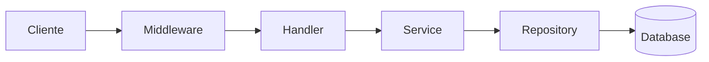

# Template Dev

Template para páginas da seção protegida /dev/ destinadas a desenvolvedores do ecossistema CARF.

Frontmatter obrigatório define title com nome técnico preciso, description com resumo técnico, section com valor dev, audience com valor dev indicando conteúdo protegido, e prerender com valor false para SSR que permite verificação de role.

Introdução assume conhecimento técnico do leitor. Pode referenciar conceitos de programação, APIs, padrões de arquitetura sem explicação. Foco em contexto específico do CARF, não em tutoriais básicos.

Corpo usa formatação técnica apropriada: code blocks com syntax highlighting para exemplos de código, inline code para nomes de funções, classes, arquivos, e variáveis. Diagramas Mermaid para fluxos e arquitetura.

Seção de configuração lista variáveis de ambiente, arquivos de config, e dependências necessárias. Formato de lista ou tabela para referência rápida.

Seção de exemplos de código mostra uso real com comentários explicando decisões não óbvias. Código deve ser copiável e funcional, não pseudo-código. Indicar arquivo onde código deve ser colocado.

Seção de troubleshooting lista erros comuns com causas e soluções. Incluir mensagens de erro exatas quando possível para facilitar busca.

Referências linkam para documentação externa relevante (libs, APIs, specs). Links para código fonte no repositório quando apropriado.

## Template Copy-Paste

```mdx
---
title: "Nome Técnico do Recurso"
description: "Descrição técnica concisa do que este documento cobre."
source: "PROJECTS/GEOAPI/DOCS/ARCHITECTURE/nome-arquivo.md"
sidebar:
  order: 1
  label: "Label Curto"
  badge: "Dev"
prerender: false
draft: false
---

import { Aside, Code, Tabs, TabItem } from '@astrojs/starlight/components';

# Nome Técnico do Recurso

Introdução direta assumindo conhecimento técnico.
Explique o contexto específico do CARF sem tutoriais básicos.

## Arquitetura

Descrição da arquitetura ou estrutura do componente.



## Configuração

### Variáveis de Ambiente

| Variável | Tipo | Obrigatório | Descrição |
|----------|------|-------------|-----------|
| `VAR_NAME` | string | Sim | Descrição da variável |
| `VAR_OPTIONAL` | number | Não | Default: 5000 |

### Dependências

```json
{
  "dependencies": {
    "jose": "^5.0.0",
    "zod": "^3.22.0"
  }
}
```

## Implementação

### Estrutura de Arquivos

```
src/
├── lib/
│   └── nome-modulo/
│       ├── index.ts        # Exports públicos
│       ├── types.ts        # Tipos TypeScript
│       ├── service.ts      # Lógica de negócio
│       └── utils.ts        # Funções auxiliares
└── pages/
    └── api/
        └── endpoint.ts     # API route
```

### Código Principal

```typescript
// src/lib/nome-modulo/service.ts
import { z } from 'zod';

const ConfigSchema = z.object({
  apiUrl: z.string().url(),
  timeout: z.number().default(5000),
  retries: z.number().default(3)
});

type Config = z.infer<typeof ConfigSchema>;

export class NomeService {
  private config: Config;

  constructor(config: Partial<Config>) {
    this.config = ConfigSchema.parse(config);
  }

  async execute(input: string): Promise<Result> {
    // Implementação
    const response = await fetch(this.config.apiUrl, {
      signal: AbortSignal.timeout(this.config.timeout)
    });

    if (!response.ok) {
      throw new ServiceError('Request failed', response.status);
    }

    return response.json();
  }
}
```

### Uso no Astro

```typescript
// src/pages/api/endpoint.ts
import type { APIRoute } from 'astro';
import { NomeService } from '../../lib/nome-modulo';

const service = new NomeService({
  apiUrl: import.meta.env.API_URL
});

export const GET: APIRoute = async ({ locals }) => {
  if (!locals.isAuthenticated) {
    return new Response('Unauthorized', { status: 401 });
  }

  try {
    const result = await service.execute('input');
    return new Response(JSON.stringify(result), {
      headers: { 'Content-Type': 'application/json' }
    });
  } catch (error) {
    console.error('[endpoint]', error);
    return new Response('Internal error', { status: 500 });
  }
};
```

<Aside type="tip">
  Sempre use `AbortSignal.timeout()` para evitar requests pendentes indefinidamente.
</Aside>

## Testes

```typescript
// src/lib/nome-modulo/__tests__/service.test.ts
import { describe, it, expect, vi } from 'vitest';
import { NomeService } from '../service';

describe('NomeService', () => {
  it('should execute successfully', async () => {
    global.fetch = vi.fn().mockResolvedValue({
      ok: true,
      json: () => Promise.resolve({ data: 'test' })
    });

    const service = new NomeService({ apiUrl: 'https://api.test.com' });
    const result = await service.execute('input');

    expect(result).toEqual({ data: 'test' });
  });

  it('should throw on error response', async () => {
    global.fetch = vi.fn().mockResolvedValue({
      ok: false,
      status: 500
    });

    const service = new NomeService({ apiUrl: 'https://api.test.com' });

    await expect(service.execute('input')).rejects.toThrow('Request failed');
  });
});
```

## Troubleshooting

### Erro: "Connection timeout"

**Causa**: API não responde dentro do timeout configurado.

**Solução**:
1. Verificar se URL está correta
2. Aumentar timeout se API é lenta
3. Verificar conectividade de rede

```typescript
// Aumentar timeout
const service = new NomeService({
  apiUrl: import.meta.env.API_URL,
  timeout: 30000 // 30 segundos
});
```

### Erro: "Zod validation failed"

**Causa**: Configuração inválida passada ao construtor.

**Solução**: Verificar que todos campos obrigatórios estão presentes com tipos corretos.

```typescript
// Errado
new NomeService({ apiUrl: 123 }); // apiUrl deve ser string

// Correto
new NomeService({ apiUrl: 'https://api.example.com' });
```

## Referências

- [Documentação Zod](https://zod.dev)
- [Astro API Routes](https://docs.astro.build/en/core-concepts/endpoints/)
- [Código fonte](https://github.com/carf/geoapi/tree/main/src/lib/nome-modulo)
```

## Exemplo Real: JWT Validation Service

```mdx
---
title: "JWT Validation Service"
description: "Serviço de validação de tokens JWT usando biblioteca jose com cache de JWKS."
source: "PROJECTS/WEBDOCS/DOCS/ARCHITECTURE/03-autenticacao.md"
sidebar:
  order: 2
  label: "JWT Validation"
  badge: "Dev"
prerender: false
draft: false
---

import { Aside, Code } from '@astrojs/starlight/components';

# JWT Validation Service

Serviço responsável por validar tokens JWT emitidos pelo Keycloak,
com cache de JWKS para otimização de performance.

## Configuração

| Variável | Obrigatório | Descrição |
|----------|-------------|-----------|
| `KEYCLOAK_URL` | Sim | URL base do Keycloak |
| `KEYCLOAK_REALM` | Sim | Nome do realm |

## Implementação

```typescript
// src/lib/auth/jwt-service.ts
import { createRemoteJWKSet, jwtVerify, JWTPayload } from 'jose';

interface TokenClaims extends JWTPayload {
  realm_access?: { roles: string[] };
  email?: string;
  name?: string;
  preferred_username?: string;
}

const KEYCLOAK_URL = import.meta.env.KEYCLOAK_URL;
const KEYCLOAK_REALM = import.meta.env.KEYCLOAK_REALM;

const JWKS = createRemoteJWKSet(
  new URL(`${KEYCLOAK_URL}/realms/${KEYCLOAK_REALM}/protocol/openid-connect/certs`)
);

export async function validateToken(token: string): Promise<TokenClaims | null> {
  try {
    const { payload } = await jwtVerify(token, JWKS, {
      issuer: `${KEYCLOAK_URL}/realms/${KEYCLOAK_REALM}`,
      audience: 'account'
    });
    return payload as TokenClaims;
  } catch (error) {
    console.error('[jwt-service] Validation failed:', error);
    return null;
  }
}

export function extractRoles(claims: TokenClaims): string[] {
  return claims.realm_access?.roles ?? [];
}
```

<Aside type="tip">
  `createRemoteJWKSet` faz cache automático das chaves públicas.
  O cache é invalidado quando uma chave não é encontrada.
</Aside>

## Referências

- [jose library](https://github.com/panva/jose)
- [Keycloak OIDC endpoints](https://www.keycloak.org/docs/latest/securing_apps/)
```

---

**Última atualização:** 2026-01-21
**Status do arquivo**: Review
