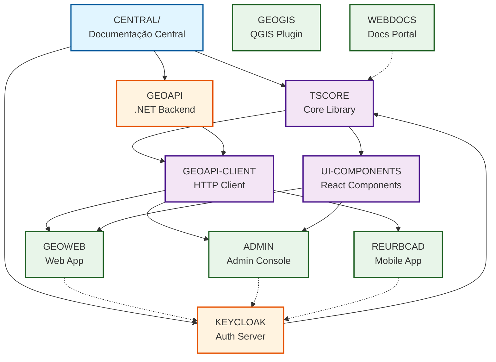

# CARF - Sistema de Regularização Fundiária Urbana

Sistema completo para gestão de processos de regularização fundiária urbana (REURB) conforme Lei 13.465/2017.

## Visão Geral

O CARF é um ecossistema integrado de aplicações para digitalização e automação dos processos de regularização fundiária urbana, permitindo que prefeituras municipais gerenciem de forma eficiente todo o ciclo da REURB desde o cadastramento de unidades habitacionais em campo até a emissão de títulos de legitimação, com documentação técnica centralizada em [CENTRAL/README.md](./CENTRAL/README.md) servindo como Single Source of Truth para arquitetura, requisitos, APIs e workflows REURB, enquanto os projetos individuais de código (backend, frontends, mobile, plugins) estão organizados na pasta PROJECTS/ com seus próprios repositórios Git independentes e documentação específica de implementação.

### Características Principais

- **Multi-tenancy**: Suporte a múltiplas prefeituras isoladas por RLS (Row-Level Security)
- **Offline-first**: Coleta de dados em campo sem conectividade
- **Geoespacial**: Integração PostGIS + QGIS para análises espaciais
- **SSO**: Single Sign-On via Keycloak entre todas as aplicações
- **Polyrepo**: 7 repositórios Git independentes com documentação centralizada
- **Clean Architecture**: DDD, CQRS, Event Sourcing no backend

## Arquitetura de Repositórios

O projeto CARF segue arquitetura **polyrepo** com **7 repositórios Git independentes** gerenciados dentro de um monorepo de documentação:

### Repositório CENTRAL (este)

Contém toda a documentação centralizada (Single Source of Truth) e referências aos 7 repositórios de código.

### 7 Repositórios de Código

Cada projeto tem seu próprio repositório Git em `PROJECTS/*/SRC-CODE/carf-*/`:

| Repositório | Localização | Descrição | Tecnologia |
|-------------|-------------|-----------|------------|
| **carf-geoapi** | `PROJECTS/GEOAPI/SRC-CODE/carf-geoapi/` | Backend API REST | .NET 9 + PostgreSQL + PostGIS |
| **carf-geoweb** | `PROJECTS/GEOWEB/SRC-CODE/carf-geoweb/` | Frontend web | React 18 + TypeScript + Tailwind |
| **carf-reurbcad** | `PROJECTS/REURBCAD/SRC-CODE/carf-reurbcad/` | App mobile | React Native + WatermelonDB |
| **carf-geogis** | `PROJECTS/GEOGIS/SRC-CODE/carf-geogis/` | Plugin QGIS | Python + PyQGIS |
| **carf-webdocs** | `PROJECTS/WEBDOCS/SRC-CODE/carf-webdocs/` | Portal de documentação | VitePress + Vue 3 |
| **carf-tscore** | `PROJECTS/TSCORE/SRC-CODE/carf-tscore/` | Biblioteca TypeScript compartilhada | TypeScript + Bun |
| **carf-admin** | `PROJECTS/ADMIN/SRC-CODE/carf-admin/` | Console administrativo | React 18 + Vite (SPA) |

**Vantagens desta estrutura:**
- ✅ Documentação centralizada (SSOT) no CENTRAL
- ✅ Código isolado por projeto (commits independentes)
- ✅ Fácil navegação entre docs e código
- ✅ Suporta diferentes workflows de desenvolvimento
- ✅ Facilita CI/CD específico por projeto

## Estrutura do Repositório

```
C:\DEV\CARF/                    # Repositório CENTRAL (este)
│
├── .git/                       # Git do CENTRAL (apenas docs e configs)
├── README.md                   # Este arquivo
│
├── CENTRAL/                    # Documentação centralizada (SSOT)
│   ├── API/                    # Especificações de API
│   ├── ARCHITECTURE/           # Decisões arquiteturais (ADRs)
│   ├── BUSINESS-RULES/         # Regras de negócio REURB
│   ├── DOMAIN-MODEL/           # Modelo de domínio
│   ├── INTEGRATION/            # Integrações externas
│   │   ├── KEYCLOAK/          # Keycloak OAuth2/OIDC + docker-compose
│   │   └── DATABASE/          # PostgreSQL + PostGIS + docker-compose
│   ├── OPERATIONS/             # DevOps, CI/CD, Monitoramento
│   ├── REQUIREMENTS/           # Requisitos funcionais e não-funcionais
│   ├── SECURITY/               # Políticas de segurança e LGPD
│   ├── TESTING/                # Estratégias e casos de teste
│   ├── VERSIONING/             # Git workflows, branching, releases
│   └── WORKFLOWS/              # Processos REURB (Lei 13.465)
│
└── PROJECTS/                   # Projetos individuais
    │
    ├── GEOAPI/
    │   ├── DOCS/               # Docs específicas do backend
    │   │   ├── ARCHITECTURE/
    │   │   ├── CONCEPTS/
    │   │   └── HOW-TO/
    │   └── SRC-CODE/
    │       └── carf-geoapi/    # Git repo independente
    │           ├── .git/       # ← Repositório Git próprio
    │           ├── src/
    │           ├── tests/
    │           └── README.md
    │
    ├── GEOWEB/
    │   ├── DOCS/
    │   │   ├── ARCHITECTURE/
    │   │   ├── CONCEPTS/
    │   │   ├── HOW-TO/
    │   │   └── LAYERS/
    │   └── SRC-CODE/
    │       └── carf-geoweb/    # Git repo independente
    │           ├── .git/
    │           ├── src/
    │           ├── public/
    │           └── README.md
    │
    ├── REURBCAD/
    │   ├── DOCS/
    │   │   ├── ARCHITECTURE/
    │   │   ├── CONCEPTS/
    │   │   ├── HOW-TO/
    │   │   └── LAYERS/
    │   └── SRC-CODE/
    │       └── carf-reurbcad/  # Git repo independente
    │           ├── .git/
    │           ├── src/
    │           ├── android/
    │           ├── ios/
    │           └── README.md
    │
    ├── GEOGIS/
    │   ├── DOCS/
    │   │   ├── ARCHITECTURE/
    │   │   ├── CONCEPTS/
    │   │   ├── HOW-TO/
    │   │   └── LAYERS/
    │   └── SRC-CODE/
    │       └── carf-geogis/    # Git repo independente
    │           ├── .git/
    │           ├── ui/
    │           ├── utils/
    │           └── README.md
    │
    ├── WEBDOCS/
    │   ├── DOCS/
    │   └── SRC-CODE/
    │       └── carf-webdocs/   # Git repo independente
    │           ├── .git/
    │           ├── docs/
    │           ├── .vitepress/
    │           └── README.md
    │
    ├── TSCORE/
    │   ├── DOCS/
    │   │   ├── API/
    │   │   ├── ARCHITECTURE/
    │   │   ├── CONCEPTS/
    │   │   └── HOW-TO/
    │   └── SRC-CODE/
    │       └── carf-tscore/    # Git repo independente
    │           ├── .git/
    │           ├── src/
    │           ├── package.json
    │           └── README.md
    │
    └── ADMIN/
        ├── DOCS/
        │   └── ARCHITECTURE/
        └── SRC-CODE/
            └── carf-admin/     # Git repo independente
                ├── .git/
                ├── src/ (em desenvolvimento)
                ├── package.json
                └── README.md
```

## Setup Inicial

### 1. Clonar o Repositório Central

```bash
# Clone este repositório (documentação + estrutura)
git clone <url-do-repo-central> CARF
cd CARF
```

### 2. Inicializar Repositórios de Código

Os repositórios de código já estão inicializados em `PROJECTS/*/SRC-CODE/carf-*/`.

Para verificar o status de todos:

```bash
# Status de todos os repos
for repo in PROJECTS/*/SRC-CODE/carf-*/.git; do
  echo "=== $(dirname $repo) ==="
  cd $(dirname $repo) && git status --short
  cd - > /dev/null
done
```

### 3. Infraestrutura Local (Docker)

#### PostgreSQL + PostGIS

```bash
cd CENTRAL/INTEGRATION/DATABASE
docker-compose up -d
```

#### Keycloak + PostgreSQL

```bash
cd CENTRAL/INTEGRATION/KEYCLOAK
docker-compose up -d
```

**Acessos:**
- Keycloak Admin: http://localhost:8080 (admin/admin)
- PostgreSQL: localhost:5432 (postgres/postgres)

### 4. Importar Realm do Keycloak

```bash
# Importar configuração completa (clients, roles, users)
cd CENTRAL/INTEGRATION/KEYCLOAK
docker exec -it keycloak /opt/keycloak/bin/kc.sh import \
  --file /opt/keycloak/data/import/realm-export.json
```

### 5. Rodar Aplicações

Ver instruções específicas em cada `PROJECTS/*/SRC-CODE/carf-*/README.md`.

**Exemplo - Backend API:**
```bash
cd PROJECTS/GEOAPI/SRC-CODE/carf-geoapi
dotnet restore
dotnet ef database update
dotnet run
```

**Exemplo - Frontend Web:**
```bash
cd PROJECTS/GEOWEB/SRC-CODE/carf-geoweb
npm install
npm run dev
```

## Documentação

### Portal de Documentação VitePress

```bash
cd PROJECTS/WEBDOCS/SRC-CODE/carf-webdocs
npm install
npm run dev
# Acesse: http://localhost:5173
```

### Documentação em Markdown

Toda documentação está em markdown neste repositório:

- **CENTRAL/**: Documentação centralizada (SSOT)
  - Arquitetura, requisitos, APIs, workflows REURB
- **PROJECTS/*/DOCS/**: Documentação específica de cada projeto
  - ARCHITECTURE: Decisões técnicas do projeto
  - CONCEPTS: Conceitos fundamentais
  - HOW-TO: Tutoriais e guias práticos
  - LAYERS: Estrutura de camadas (quando aplicável)

### Convenções de Documentação

**Formato de Parágrafo Denso:** Todos os arquivos de documentação do projeto (exceto este README.md principal) devem seguir formato de parágrafo denso otimizado para processamento por IA, onde cada seção contém um ou no máximo dois parágrafos contínuos que condensam todas as informações relevantes sem quebras, listas ou seções separadas, permitindo que modelos de linguagem processem o conteúdo de forma mais eficiente e mantenham contexto completo sem fragmentação. Links e referências devem estar embutidos inline dentro do texto do parágrafo usando sintaxe markdown padrão com colchetes e parênteses ao invés de seções separadas de "Referências" ou "Links Relacionados" no final do documento, e código deve ser referenciado com backticks inline ao invés de blocos de exemplo exceto em seções específicas de "## Comandos" quando aplicável.

**Evitar Conteúdo Volátil:** Documentação não deve conter números fixos (como "221+ requisitos" ou "350 arquivos") que ficam desatualizados rapidamente, nem datas específicas (exceto em changelogs e release notes), preferindo termos descritivos como "requisitos funcionais e não-funcionais do sistema" ou "última atualização em CHANGELOG.md". Este README.md principal é a única exceção que permite estrutura livre com múltiplas seções, listas e code blocks para facilitar navegação inicial do projeto.

### Mapa de Dependências

O diagrama abaixo mostra como a documentação centralizada (CENTRAL) se relaciona com as bibliotecas compartilhadas e aplicações:



### Documentos Mais Referenciados

Os documentos centrais mais importantes e suas relações:

1. **[Domain Model](./CENTRAL/DOMAIN-MODEL/00-INDEX.md)** - Entidades core (Unit, Holder, Community, LegitimationRequest)
   - Implementado por: TSCORE, GEOAPI
   - Referenciado por: GEOWEB, REURBCAD, ADMIN

2. **[Architecture ADRs](./CENTRAL/ARCHITECTURE/README.md)** - Decisões arquiteturais
   - ADR-001: .NET 9 Backend
   - ADR-003: Keycloak Autenticação
   - ADR-008: Clean Architecture + DDD
   - ADR-009: CQRS Pattern
   - ADR-011: Shared TypeScript Library

3. **[Keycloak Integration](./CENTRAL/INTEGRATION/KEYCLOAK/README.md)** - OAuth2/OIDC, SSO, Multi-tenancy
   - Implementado por: KEYCLOAK, TSCORE
   - Usado por: Todas as aplicações

4. **[TSCORE Library](./PROJECTS/LIB/TS/TSCORE/DOCS/README.md)** - Biblioteca core compartilhada
   - Fornece: Types, validações, auth hooks
   - Usado por: GEOAPI-CLIENT, UI-COMPONENTS, GEOWEB, ADMIN, REURBCAD, WEBDOCS

5. **[API Specification](./CENTRAL/API/README.md)** - Endpoints REST
   - Implementado por: GEOAPI
   - Consumido via: GEOAPI-CLIENT

6. **[Security Policies](./CENTRAL/SECURITY/README.md)** - Políticas de segurança LGPD
   - Implementado por: GEOAPI, KEYCLOAK
   - Aplicado em: ADMIN, GEOWEB

7. **[Business Rules](./CENTRAL/BUSINESS-RULES/README.md)** - Regras REURB Lei 13.465/2017
   - Implementado por: GEOAPI (validações)
   - Aplicado em: GEOWEB (UI rules)

8. **[Libraries Index](./CENTRAL/LIBRARIES/README.md)** - Índice das 3 bibliotecas TypeScript
   - Referenciado por: Todos os frontends

### Índices Principais

- [Arquitetura](./CENTRAL/ARCHITECTURE/README.md) - ADRs e decisões arquiteturais
- [Requisitos](./CENTRAL/REQUIREMENTS/README.md) - Requisitos funcionais e não-funcionais
- [API Reference](./CENTRAL/API/README.md) - Endpoints REST documentados
- [Regras de Negócio](./CENTRAL/BUSINESS-RULES/README.md) - Processos REURB (Lei 13.465)
- [Keycloak Setup](./CENTRAL/INTEGRATION/KEYCLOAK/README.md) - OAuth2/OIDC, SSO, Multi-tenancy
- [Database](./CENTRAL/INTEGRATION/DATABASE/README.md) - PostgreSQL + PostGIS + RLS
- [Versionamento](./CENTRAL/VERSIONING/README.md) - Git workflows, branching, releases

## Stack Tecnológica

### Backend
- **.NET 9** - Framework backend
- **PostgreSQL 16** + **PostGIS 3.4** - Banco geoespacial
- **Keycloak 24** - OAuth2/OIDC SSO
- **Entity Framework Core** - ORM
- **MediatR** - CQRS pattern
- **FluentValidation** - Validações
- **Serilog** - Logging estruturado

### Frontend Web
- **React 18** + **TypeScript 5**
- **Vite** - Build tool
- **TanStack Query** - Server state
- **Zustand** - Client state
- **Tailwind CSS** + **shadcn/ui** - UI/Styling
- **Leaflet** - Mapas interativos

### Mobile
- **React Native** + **TypeScript**
- **WatermelonDB** - Banco offline
- **React Navigation** - Navegação
- **React Native Maps** - Mapas nativos
- **NetInfo** - Detecção de conectividade

### QGIS Plugin
- **Python 3.11** + **PyQGIS**
- **Shapely** - Operações geométricas
- **requests** - HTTP client

### Admin Console
- **Next.js 14** + **React 18** + **TypeScript**
- **shadcn/ui** + **Tailwind CSS**
- **@keycloak/keycloak-admin-client** - Keycloak Admin API
- **TanStack Query** - Data fetching

### Shared Library
- **TypeScript** + **Bun**
- **React 18** hooks + **Vue 3** composables
- Publicado como **@carf/tscore** (npm)

### Docs Portal
- **VitePress** + **Vue 3**
- **Markdown** + **Mermaid** (diagramas)

## Legislação

- **Lei 13.465/2017** - Regularização Fundiária Urbana (REURB)
- **Lei 10.257/2001** - Estatuto da Cidade
- **Decreto 9.310/2018** - Regulamentação REURB

Ver [CENTRAL/WORKFLOWS/README.md](./CENTRAL/WORKFLOWS/README.md) para processos detalhados da REURB.

## Contribuindo

### Workflow de Desenvolvimento

1. Identifique o repositório apropriado (carf-geoapi, carf-geoweb, etc.)
2. Navegue até `PROJECTS/*/SRC-CODE/carf-*/`
3. Crie uma branch: `git checkout -b feature/minha-feature`
4. Faça commits seguindo [Conventional Commits](./CENTRAL/VERSIONING/GIT/03-commit-conventions.md)
5. Push: `git push origin feature/minha-feature`
6. Abra um Pull Request

### Guidelines

- [Commit Conventions](./CENTRAL/VERSIONING/GIT/03-commit-conventions.md) - Semantic commits
- [PR Guidelines](./CENTRAL/VERSIONING/GIT/04-pr-guidelines.md) - Pull request workflow
- [Branching Strategy](./CENTRAL/VERSIONING/GIT/02-branching-strategy.md) - Git flow

### Documentação

- **Docs compartilhadas**: Edite em `CENTRAL/`
- **Docs específicas**: Edite em `PROJECTS/*/DOCS/`
- **Código**: Cada projeto tem seu próprio repo em `PROJECTS/*/SRC-CODE/carf-*/`

## Estrutura de Commits

```
CENTRAL (este repo):
  - Documentação centralizada
  - Configurações compartilhadas
  - Estrutura de pastas PROJECTS/

Cada carf-* repo:
  - Código-fonte específico
  - Testes
  - CI/CD próprio
  - README específico
```

O `.gitignore` do CENTRAL ignora os repos internos:
```gitignore
# Repositórios Git Independentes
PROJECTS/*/SRC-CODE/carf-*/
```

## Licença

Copyright © 2024-2026 - Sistema CARF

**UNLICENSED** (Proprietário)

## Suporte

- **Documentação**: Ver `CENTRAL/` e `PROJECTS/*/DOCS/`
- **Issues**: Abrir no repositório correspondente (carf-geoapi, carf-geoweb, etc.)
- **Troubleshooting**: Ver `PROJECTS/*/DOCS/HOW-TO/` de cada projeto

## Status do Projeto

- **Versão**: v1.0.0 MVP
- **Status**: 🚧 Em desenvolvimento
- **Última atualização**: 2026-01-09

### Repositórios Inicializados

- ✅ **carf-geoapi** - Backend .NET 9
- ✅ **carf-geoweb** - Frontend React 18
- ✅ **carf-reurbcad** - Mobile React Native
- ✅ **carf-geogis** - Plugin QGIS Python
- ✅ **carf-webdocs** - Docs VitePress
- ✅ **carf-tscore** - Shared Library TypeScript
- ✅ **carf-admin** - Admin Console React SPA

---

## Notas de Segurança - ADMIN Console

### Arquitetura Segura

O **carf-admin** é uma **SPA React** que consome endpoints `/api/admin/*` do **GEOAPI**.

**Por que não Next.js?**

Next.js foi descartado por **segurança**:
- Keycloak Admin Client API requer `client_secret` confidencial
- Secrets no frontend (mesmo Next.js) podem vazar
- Backend .NET oferece melhor isolamento

**Arquitetura:**
```
carf-admin (SPA React)  →  GEOAPI /api/admin/*  →  Keycloak Admin API
     ↑ PKCE (sem secret)        ↑ confidential            ↑ client_secret
```

**7 Camadas de Segurança:**
1. ✅ OAuth2 authentication (JWT)
2. ✅ Role-based authorization (super-admin/admin only)
3. ✅ Tenant validation (admins só veem próprio tenant)
4. ✅ Rate limiting (100 req/min por IP)
5. ✅ CORS restrito (apenas origens permitidas)
6. ✅ Auditoria completa (quem, quando, o quê)
7. ✅ Keycloak Admin Client isolado (backend confidential)

Ver [Documentação Completa de Segurança](./PROJECTS/GEOAPI/DOCS/ARCHITECTURE/02-admin-security.md)
