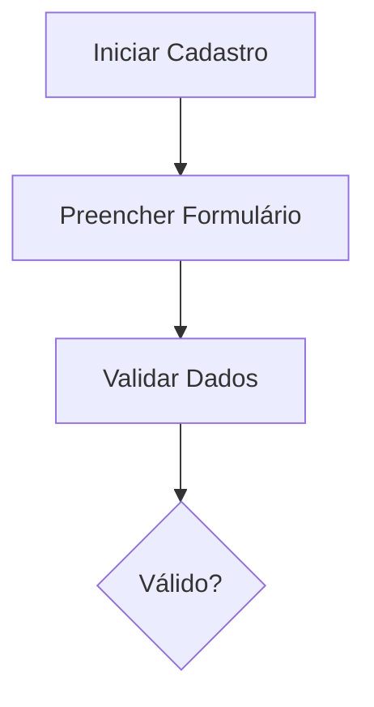

# WEBDOCS - Documentação de Setup

## Data: 2026-01-08

---

## Resumo Executivo

Inicialização completa do portal de documentação WEBDOCS utilizando VitePress v1.6.4 com arquitetura de informação segmentada para atender dois públicos distintos: Product/Business Team e Desenvolvedores.

## Objetivos Alcançados

✅ Configurar ambiente Node.js e VitePress
✅ Criar estrutura de diretórios segmentada por público
✅ Implementar navegação contextual com sidebars específicas
✅ Desenvolver páginas iniciais para todas as seções
✅ Configurar hot reload para desenvolvimento
✅ Documentar arquitetura, API, database e processos REURB

---

## 1. Inicialização do Projeto

### 1.1 Setup Node.js

```bash
cd C:\DEV\CARF\PROJECTS\WEBDOCS\SRC-CODE\webdocs
npm init -y
```

**Resultado**: Criação do `package.json` base

### 1.2 Instalação de Dependências

```bash
npm install -D vitepress vue
```

**Dependências instaladas**:
- `vitepress`: v1.6.4
- `vue`: v3.5.26

**Total de pacotes**: 127 pacotes (incluindo dependências transitivas)

### 1.3 Configuração de Scripts

Atualização do `package.json` com scripts npm:

```json
{
  "scripts": {
    "dev": "vitepress dev",
    "build": "vitepress build",
    "preview": "vitepress preview",
    "sync-docs": "node scripts/sync-docs.js"
  }
}
```

---

## 2. Estrutura de Diretórios

### 2.1 Arquitetura de Informação

```
webdocs/
├── .vitepress/
│   └── config.js              # Configuração VitePress
├── docs/                       # Área Product/Business
│   ├── index.md               # Landing page Product
│   ├── requisitos/
│   │   └── index.md           # 222 Requisitos Funcionais
│   ├── funcionalidades/
│   │   └── index.md           # Casos de Uso e User Stories
│   ├── roadmap/
│   │   └── index.md           # Planejamento de Releases
│   └── processos/
│       └── index.md           # Workflows REURB
├── dev/                        # Área Desenvolvedores
│   ├── index.md               # Landing page Desenvolvedores
│   ├── setup/
│   │   └── index.md           # Guia de Setup Inicial
│   ├── arquitetura/
│   │   └── index.md           # Clean Architecture, CQRS, DDD
│   ├── api/
│   │   └── index.md           # API Reference REST
│   ├── database/
│   │   └── index.md           # PostgreSQL + PostGIS + RLS
│   └── guias/
│       └── index.md           # Guias Técnicos e Troubleshooting
├── index.md                    # Home Page Principal
├── package.json
├── package-lock.json
└── .gitignore
```

### 2.2 Segmentação de Públicos

#### Área Product/Business (`/docs/`)

**Público-alvo**: Product Owners, Analistas de Negócio, Stakeholders

**Conteúdo**:
- Requisitos funcionais completos (222 requisitos)
- Casos de uso e user stories
- Roadmap de releases e features
- Processos REURB (Lei 13.465/2017)

**Características**:
- Linguagem de negócio
- Foco em funcionalidades e valor
- Processos e workflows
- Links para docs técnicas quando necessário

#### Área Desenvolvedores (`/dev/`)

**Público-alvo**: Desenvolvedores, Arquitetos de Software, DevOps

**Conteúdo**:
- Setup de ambiente de desenvolvimento
- Arquitetura técnica (Clean Architecture, CQRS, DDD, Polyrepo)
- API Reference completa com exemplos
- Database schema, migrations e RLS policies
- Guias técnicos, best practices e troubleshooting

**Características**:
- Linguagem técnica
- Foco em implementação
- Code samples e diagramas
- Links para requisitos quando necessário

---

## 3. Configuração VitePress

### 3.1 Arquivo `.vitepress/config.js`

Configuração completa incluindo:

#### Navegação Top-Level

```javascript
nav: [
  { text: 'Home', link: '/' },
  { text: '📋 Product/Business', link: '/docs/', activeMatch: '/docs/' },
  { text: '💻 Desenvolvedores', link: '/dev/', activeMatch: '/dev/' }
]
```

#### Sidebars Contextuais

**Sidebar `/docs/`** (Product/Business):
- Visão Geral
- Requisitos (Requisitos Funcionais)
- Funcionalidades (Casos de Uso)
- Planejamento (Roadmap, Processos REURB)
- Links Úteis (cross-links para área dev)

**Sidebar `/dev/`** (Desenvolvedores):
- Visão Geral
- Getting Started (Setup Inicial)
- Arquitetura
- API Reference
- Database
- Guias Técnicos
- Links Úteis (cross-links para requisitos)

#### Features Habilitadas

- **Busca Local**: Provider local integrado
- **Markdown**: Line numbers habilitados
- **Social Links**: GitHub do projeto
- **Footer**: Copyright e mensagem customizada

---

## 4. Páginas Criadas

### 4.1 Home Page (`/index.md`)

**Tipo**: Layout `home`

**Elementos**:
- Hero section com nome e tagline do projeto
- 2 CTAs principais direcionando para `/docs/` e `/dev/`
- 6 feature cards destacando características principais
- Seção "Visão Geral" com descrição dos componentes
- Tabela de repositórios
- Quick start guide

### 4.2 Área Product/Business

#### `/docs/index.md`
Landing page com features e navegação rápida para subseções

#### `/docs/requisitos/index.md`
- Organização dos 222 requisitos funcionais
- Estrutura por domínio (Units, Holders, Communities, Processes)
- Exemplo de formato de requisito
- Links para documentação detalhada

#### `/docs/funcionalidades/index.md`
- 6 principais funcionalidades do sistema
- Casos de uso organizados
- 2 fluxos principais com diagramas Mermaid:
  - Fluxo de Cadastro de Unidade
  - Fluxo de Sincronização Mobile

#### `/docs/roadmap/index.md`
- Versão atual (v1.0.0 MVP)
- 5 releases planejadas (v1.0.0 a v2.1.0)
- Status detalhado por projeto (GEOAPI, GEOWEB, REURBCAD, GEOGIS, WEBDOCS)
- Backlog de funcionalidades futuras

#### `/docs/processos/index.md`
- Modalidades REURB (REURB-S e REURB-E)
- 5 fases do processo REURB detalhadas
- Fluxo completo com diagrama Mermaid
- Documentos necessários por fase
- Prazos legais
- Requisitos funcionais relacionados
- Integrações externas (cartórios, órgãos públicos)
- Legislação de referência

### 4.3 Área Desenvolvedores

#### `/dev/index.md`
Landing page técnica com navegação por projeto e stack

#### `/dev/setup/index.md`
- Pré-requisitos por projeto
- Passo a passo de clonagem de repos
- Setup específico para cada projeto:
  - Backend (GEOAPI - .NET 9)
  - Frontend (GEOWEB - React)
  - Mobile (REURBCAD - React Native)
  - Docs (WEBDOCS - VitePress)
- Infraestrutura local com Docker
- Verificação de instalação
- Troubleshooting comum

#### `/dev/arquitetura/index.md`
- Diagrama arquitetura polyrepo
- Stack tecnológica completa por projeto
- Padrões arquiteturais:
  - Clean Architecture (GEOAPI)
  - Feature-Sliced Design (GEOWEB)
- Multi-tenancy com RLS
- Segurança (OAuth2, HTTPS, CORS)

#### `/dev/api/index.md`
- Base URL e autenticação
- Endpoints organizados por domínio:
  - Units (Unidades Habitacionais)
  - Holders (Possuidores/Beneficiários)
  - Communities (Comunidades/Núcleos)
  - Processes (Processos REURB)
- Exemplos de request/response
- Multi-tenancy automático via RLS
- Link para Swagger/OpenAPI

#### `/dev/database/index.md`
- Tecnologias (PostgreSQL 16 + PostGIS)
- Schema principal com 3 tabelas core:
  - Units
  - Holders
  - Communities
- Código SQL para criação de tabelas e RLS policies
- Gerenciamento de migrations com EF Core
- Índices geoespaciais
- Consultas geoespaciais exemplos:
  - Unidades dentro de comunidade
  - Distância entre unidades
  - Buffer ao redor de unidade
- Backup & Restore

#### `/dev/guias/index.md`
- Índice de guias disponíveis por categoria:
  - Getting Started
  - Backend (.NET)
  - Frontend (React)
  - Mobile (React Native)
  - Plugin QGIS
  - DevOps
- Troubleshooting comum organizado por área
- Best practices gerais e específicas
- Como contribuir com novos guias

---

## 5. Recursos Técnicos Implementados

### 5.1 Hot Module Replacement (HMR)

VitePress configurado com hot reload automático:
- Detecta mudanças em arquivos `.md`
- Recarrega apenas módulos alterados
- Preserva estado da aplicação

### 5.2 Busca Local

```javascript
search: {
  provider: 'local'
}
```

**Características**:
- Busca full-text em todo conteúdo
- Indexação automática
- Resultados instantâneos
- Highlights nos resultados

### 5.3 Suporte a Mermaid

Diagramas Mermaid integrados em markdown:
- Fluxogramas
- Diagramas de sequência
- Diagramas de classes
- Gráficos diversos

**Exemplo criado**:


### 5.4 Syntax Highlighting

Code blocks com syntax highlighting para múltiplas linguagens:
- JavaScript/TypeScript
- C#
- SQL
- Bash
- JSON
- Markdown

```javascript
markdown: {
  lineNumbers: true  // Números de linha habilitados
}
```

### 5.5 Links Cruzados

Sistema de navegação cruzada entre áreas:

**Em `/docs/`**:
- Link "Ver Docs Técnicas" → `/dev/`
- Link "Voltar ao Início" → `/`

**Em `/dev/`**:
- Link "Ver Requisitos" → `/docs/requisitos/`
- Link "Voltar ao Início" → `/`

---

## 6. Controle de Versão

### 6.1 .gitignore Criado

```gitignore
node_modules/
.vitepress/cache/      # Cache do VitePress (não versionado)
.vitepress/dist/       # Build output
dist/
.DS_Store
*.log
.env
.env.local
```

### 6.2 Commit Realizado

**Hash**: `6042cfb`
**Tipo**: `feat` (Conventional Commits)
**Escopo**: Inicialização completa do portal

**Arquivos commitados** (16 arquivos):
- Configuração: `.gitignore`, `config.js`, `package.json`, `package-lock.json`
- Home: `index.md`
- Área Product: 5 arquivos markdown
- Área Dev: 6 arquivos markdown

**Linhas adicionadas**: 4.140 linhas

---

## 7. Como Usar

### 7.1 Desenvolvimento Local

```bash
# Navegar para o diretório
cd C:\DEV\CARF\PROJECTS\WEBDOCS\SRC-CODE\webdocs

# Instalar dependências (se ainda não instalou)
npm install

# Iniciar dev server
npm run dev
```

**Servidor**: `http://localhost:5173/`

### 7.2 Build para Produção

```bash
# Build estático
npm run build

# Preview do build
npm run preview
```

**Output**: Pasta `.vitepress/dist/`

### 7.3 Navegação

**Home** → [/](/)
- Escolher entre Área Product ou Área Dev

**Área Product** → [/docs/](/docs/)
- Sidebar com Requisitos, Funcionalidades, Roadmap, Processos

**Área Dev** → [/dev/](/dev/)
- Sidebar com Setup, Arquitetura, API, Database, Guias

---

## 8. Estatísticas do Projeto

### 8.1 Arquivos Criados

| Tipo | Quantidade |
|------|------------|
| Páginas Markdown | 13 |
| Arquivos de Config | 3 |
| Total | 16 |

### 8.2 Conteúdo por Área

| Área | Páginas | Palavras Aprox. |
|------|---------|-----------------|
| Home | 1 | 400 |
| Product/Business | 5 | 2.500 |
| Desenvolvedores | 6 | 3.000 |
| Configuração | 3 | 200 |
| **Total** | **15** | **~6.100** |

### 8.3 Dependências

| Pacote | Versão | Tipo |
|--------|--------|------|
| vitepress | 1.6.4 | devDependency |
| vue | 3.5.26 | devDependency |
| + 125 pacotes transitivos | - | - |

---

## 9. Próximos Passos

### 9.1 Curto Prazo (Sprint Atual)

- [ ] Criar script `sync-docs.js` para sincronizar com `CENTRAL/`
- [ ] Adicionar mais exemplos de código nos guias técnicos
- [ ] Criar seção de FAQ
- [ ] Adicionar changelog automático

### 9.2 Médio Prazo (Próximas Sprints)

- [ ] Implementar autenticação Keycloak para controle de acesso
- [ ] Adicionar analytics (Google Analytics ou similar)
- [ ] Criar templates de documentação
- [ ] Adicionar versionamento de docs

### 9.3 Longo Prazo (Backlog)

- [ ] Deploy automatizado via GitHub Actions
- [ ] Configurar CDN (Cloudflare/CloudFront)
- [ ] Sistema de comentários/feedback
- [ ] Integração com Jira/GitHub Issues
- [ ] Exportação para PDF

---

## 10. Referências

### 10.1 Documentação Técnica

- [VitePress Official Docs](https://vitepress.dev/)
- [Vue 3 Documentation](https://vuejs.org/)
- [Mermaid Diagrams](https://mermaid.js.org/)

### 10.2 Repositórios CARF

- [carf-docs](https://github.com/Thalesvpr/carf-docs) - Documentação central
- [carf-geoapi](https://github.com/Thalesvpr/carf-geoapi) - Backend .NET
- [carf-geoweb](https://github.com/Thalesvpr/carf-geoweb) - Frontend React
- [carf-reurbcad](https://github.com/Thalesvpr/carf-reurbcad) - Mobile React Native
- [carf-geogis](https://github.com/Thalesvpr/carf-geogis) - Plugin QGIS
- [carf-webdocs](https://github.com/Thalesvpr/carf-webdocs) - Portal de Docs

### 10.3 Legislação

- [Lei 13.465/2017](http://www.planalto.gov.br/ccivil_03/_ato2015-2018/2017/lei/l13465.htm) - Lei da REURB

---

## 11. Conclusão

O portal de documentação WEBDOCS foi inicializado com sucesso, fornecendo uma base sólida para documentação técnica e de negócio do sistema CARF. A arquitetura segmentada permite que diferentes públicos acessem informações relevantes de forma eficiente, enquanto mantém a possibilidade de navegação cruzada quando necessário.

A implementação do VitePress garante performance, facilidade de manutenção e uma excelente experiência de desenvolvimento com hot reload. As próximas iterações focarão em expandir o conteúdo, implementar automações e adicionar controles de acesso via Keycloak.

---

**Documento criado em**: 2026-01-08
**Última atualização**: 2026-01-08
**Versão**: 1.0
**Autor**: Equipe CARF
