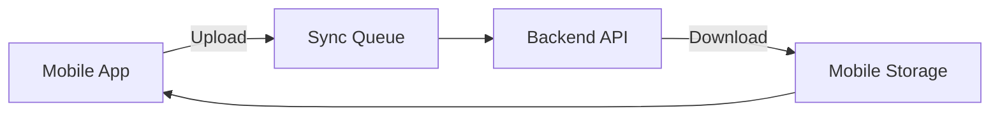

# Sincronização Mobile-Backend

Guia de sincronização de dados entre o app mobile REURBCAD e o backend GEOAPI.

## Visão Geral

O sistema CARF implementa sincronização bidirecional entre o app mobile (React Native) e o backend (.NET), permitindo trabalho offline em campo e posterior sincronização quando houver conectividade.

## Arquitetura de Sincronização



## Estratégias de Sincronização

### 1. Sincronização Manual

O usuário aciona sincronização manualmente via botão no app:

```typescript
// Mobile (React Native)
import { useSyncMutation } from '@/hooks/useSync';

function SyncButton() {
  const { mutate: sync, isLoading } = useSyncMutation();

  return (
    <Button onPress={() => sync()} disabled={isLoading}>
      {isLoading ? 'Sincronizando...' : 'Sincronizar'}
    </Button>
  );
}
```

### 2. Sincronização Automática

Sincronização automática quando conectividade é detectada:

```typescript
import NetInfo from '@react-native-community/netinfo';
import { syncQueue } from '@/services/syncQueue';

NetInfo.addEventListener(state => {
  if (state.isConnected && state.isInternetReachable) {
    syncQueue.processQueue();
  }
});
```

### 3. Sincronização em Background

Sincronização periódica em background (Android):

```typescript
import BackgroundFetch from 'react-native-background-fetch';

BackgroundFetch.configure({
  minimumFetchInterval: 15, // minutos
  stopOnTerminate: false
}, async (taskId) => {
  await syncQueue.processQueue();
  BackgroundFetch.finish(taskId);
});
```

## Fluxo de Sincronização

### Upload (Mobile → Backend)

1. **Coletar Dados Pendentes**
```typescript
const pendingUnits = await db.units.where('syncStatus').equals('pending').toArray();
const pendingHolders = await db.holders.where('syncStatus').equals('pending').toArray();
```

2. **Criar Payload de Sincronização**
```typescript
const syncPayload = {
  units: pendingUnits.map(u => ({
    localId: u.id,
    code: u.code,
    address: u.address,
    geometry: u.geometry,
    // ... outros campos
  })),
  holders: pendingHolders.map(h => ({
    localId: h.id,
    name: h.name,
    document: h.document,
    // ... outros campos
  }))
};
```

3. **Enviar para Backend**
```typescript
const response = await api.post('/api/sync/upload', syncPayload, {
  headers: {
    'Authorization': `Bearer ${token}`,
    'X-Sync-Version': '1.0'
  }
});
```

4. **Processar Resposta**
```typescript
// Mapear IDs locais para IDs do servidor
response.data.units.forEach(unit => {
  await db.units.update(unit.localId, {
    id: unit.serverId,
    syncStatus: 'synced',
    lastSyncAt: new Date()
  });
});
```

### Download (Backend → Mobile)

1. **Obter Timestamp da Última Sincronização**
```typescript
const lastSync = await db.metadata.get('lastSyncTimestamp');
```

2. **Requisitar Dados Atualizados**
```typescript
const response = await api.get('/api/sync/download', {
  params: {
    since: lastSync || '1970-01-01T00:00:00Z',
    tenantId: currentTenant.id
  }
});
```

3. **Atualizar Banco Local**
```typescript
await db.transaction('rw', [db.units, db.holders], async () => {
  // Inserir/Atualizar unidades
  for (const unit of response.data.units) {
    await db.units.put(unit);
  }

  // Inserir/Atualizar possuidores
  for (const holder of response.data.holders) {
    await db.holders.put(holder);
  }

  // Atualizar timestamp
  await db.metadata.put({
    key: 'lastSyncTimestamp',
    value: new Date().toISOString()
  });
});
```

## Resolução de Conflitos

### Estratégia: Last Write Wins (LWW)

O sistema usa timestamps para resolver conflitos:

```typescript
function resolveConflict(localData, serverData) {
  if (serverData.updatedAt > localData.updatedAt) {
    // Servidor mais recente - aceitar versão do servidor
    return serverData;
  } else {
    // Local mais recente - manter versão local
    return localData;
  }
}
```

### Estratégia Personalizada por Campo

Para casos específicos, implementar lógica customizada:

```typescript
function mergeUnit(localUnit, serverUnit) {
  return {
    id: serverUnit.id,
    code: serverUnit.code, // Sempre do servidor
    address: localUnit.address || serverUnit.address, // Preferir local se existir
    area: Math.max(localUnit.area, serverUnit.area), // Maior área
    geometry: localUnit.geometry || serverUnit.geometry,
    photos: [...localUnit.photos, ...serverUnit.photos], // Merge de arrays
    updatedAt: new Date().toISOString()
  };
}
```

## Armazenamento Local

### Dexie.js (IndexedDB)

```typescript
import Dexie, { Table } from 'dexie';

export class CarfDatabase extends Dexie {
  units!: Table<Unit>;
  holders!: Table<Holder>;

  constructor() {
    super('CarfDB');
    this.version(1).stores({
      units: 'id, code, communityId, syncStatus, updatedAt',
      holders: 'id, document, syncStatus, updatedAt',
      metadata: 'key'
    });
  }
}

export const db = new CarfDatabase();
```

## Indicadores de Sincronização

### Status de Sincronização

```typescript
enum SyncStatus {
  PENDING = 'pending',       // Aguardando sincronização
  SYNCING = 'syncing',       // Em processo de sincronização
  SYNCED = 'synced',         // Sincronizado
  CONFLICT = 'conflict',     // Conflito detectado
  ERROR = 'error'            // Erro na sincronização
}
```

### UI de Sincronização

```typescript
function SyncIndicator({ unit }: { unit: Unit }) {
  const icons = {
    pending: '⏳',
    syncing: '🔄',
    synced: '✅',
    conflict: '⚠️',
    error: '❌'
  };

  return (
    <View>
      <Text>{icons[unit.syncStatus]}</Text>
      <Text>{unit.syncStatus}</Text>
    </View>
  );
}
```

## Otimizações

### Compressão de Dados

```typescript
import pako from 'pako';

const compressedPayload = pako.gzip(JSON.stringify(syncPayload));

await api.post('/api/sync/upload', compressedPayload, {
  headers: {
    'Content-Encoding': 'gzip',
    'Content-Type': 'application/json'
  }
});
```

### Delta Sync

Sincronizar apenas mudanças desde último sync:

```typescript
const changes = await db.units
  .where('updatedAt')
  .above(lastSyncTimestamp)
  .toArray();
```

### Batch Upload

Agrupar múltiplos registros em um único request:

```typescript
const BATCH_SIZE = 50;

for (let i = 0; i < pendingUnits.length; i += BATCH_SIZE) {
  const batch = pendingUnits.slice(i, i + BATCH_SIZE);
  await api.post('/api/sync/upload', { units: batch });
}
```

## Tratamento de Erros

```typescript
async function syncWithRetry(maxRetries = 3) {
  let attempt = 0;

  while (attempt < maxRetries) {
    try {
      await syncQueue.processQueue();
      return { success: true };
    } catch (error) {
      attempt++;

      if (error.response?.status === 401) {
        // Token expirado - renovar
        await refreshToken();
      } else if (error.response?.status === 409) {
        // Conflito - resolver manualmente
        await handleConflicts();
      } else if (attempt >= maxRetries) {
        // Falha definitiva
        return { success: false, error };
      }

      // Backoff exponencial
      await sleep(Math.pow(2, attempt) * 1000);
    }
  }
}
```

## Monitoramento

### Logs de Sincronização

```typescript
interface SyncLog {
  id: string;
  timestamp: Date;
  direction: 'upload' | 'download';
  recordCount: number;
  duration: number;
  status: 'success' | 'error';
  error?: string;
}

await db.syncLogs.add({
  id: uuid(),
  timestamp: new Date(),
  direction: 'upload',
  recordCount: pendingUnits.length,
  duration: Date.now() - startTime,
  status: 'success'
});
```

### Métricas

- **Sync Success Rate**: % sincronizações bem-sucedidas
- **Average Sync Time**: Tempo médio de sincronização
- **Pending Records**: Registros aguardando sincronização
- **Conflict Rate**: Taxa de conflitos detectados

## Testes

### Teste de Sincronização

```typescript
describe('Sync Service', () => {
  it('should upload pending units', async () => {
    const pendingUnit = { id: 'local-1', code: 'UN-001', syncStatus: 'pending' };
    await db.units.add(pendingUnit);

    const result = await syncService.upload();

    expect(result.success).toBe(true);
    const syncedUnit = await db.units.get('local-1');
    expect(syncedUnit.syncStatus).toBe('synced');
  });
});
```

## Recursos Adicionais

- [Offline-First Architecture](https://offlinefirst.org/)
- [IndexedDB Best Practices](https://web.dev/indexeddb-best-practices/)
- [Background Sync API](https://developer.mozilla.org/en-US/docs/Web/API/Background_Synchronization_API)
