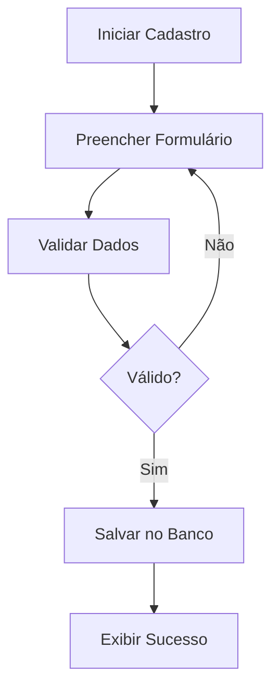
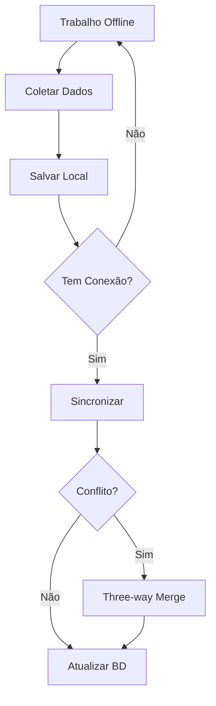

# Funcionalidades

Casos de uso e user stories do sistema CARF.

## Principais Funcionalidades

### 1. Gestão de Unidades Habitacionais

- Cadastro de unidades com dados geoespaciais
- Edição e visualização de informações
- Busca e filtros avançados
- Exportação para formatos GIS (shapefile, GeoJSON)

### 2. Gestão de Possuidores/Beneficiários

- Cadastro de pessoas físicas e jurídicas
- Validação de CPF/CNPJ
- Histórico de ocupação
- Documentação anexada

### 3. Gestão de Comunidades/Núcleos

- Delimitação de áreas geográficas
- Agrupamento de unidades
- Estatísticas por comunidade
- Mapas interativos

### 4. Processos REURB

- Criação de processos de regularização
- Workflow de aprovação
- Acompanhamento de status
- Geração de documentos oficiais

### 5. Mobile Offline-First

- Coleta de dados em campo sem conexão
- Sincronização incremental
- GPS tracking
- Captura de fotos

### 6. Integrações GIS

- Plugin QGIS para edição avançada
- Operações geoespaciais (buffer, intersect, etc)
- Importação/exportação de camadas
- Sincronização bidirecional

## Casos de Uso

A documentação completa dos casos de uso está em:

- [CENTRAL/REQUIREMENTS/USE-CASES](https://github.com/Thalesvpr/carf-docs/tree/main/CENTRAL/REQUIREMENTS)

## User Stories

As user stories estão organizadas por projeto:

- **GEOWEB**: Interface web para gestores
- **REURBCAD**: App mobile para trabalho de campo
- **GEOGIS**: Plugin QGIS para análise geoespacial

## Fluxos Principais

### Fluxo de Cadastro de Unidade

### Fluxo de Sincronização Mobile

## Próximos Passos

- Ver [Requisitos](/docs/requisitos/)
- Consultar [API](/dev/api/)
- Entender a [Arquitetura](/dev/arquitetura/)
