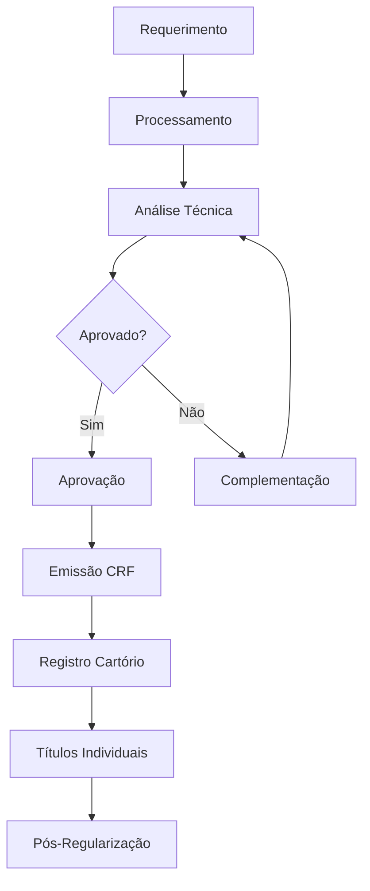

# Processos REURB

Workflows e fluxos de regularização fundiária urbana conforme Lei 13.465/2017.

## Visão Geral

A REURB (Regularização Fundiária Urbana) é o processo de integração de assentamentos irregulares ao contexto urbano legal, por meio da legalização das ocupações e melhorias urbanísticas.

## Modalidades REURB

### REURB-S (Social)

**Público**: Núcleos urbanos informais ocupados por população de baixa renda.

**Características**:
- Gratuidade do procedimento
- Isenção de custas e emolumentos
- Prioridade na tramitação
- Assistência técnica gratuita

### REURB-E (Específica)

**Público**: Núcleos urbanos informais ocupados por não enquadrados como baixa renda.

**Características**:
- Cobrança de custas e emolumentos
- Tramitação normal
- Responsabilidade técnica própria

## Fases do Processo REURB

### 1. Requerimento

**Responsável**: Legitimados (União, Estado, Município, moradores, etc)

**Atividades**:
- Identificação do núcleo urbano informal
- Delimitação da área
- Levantamento de dados preliminares
- Abertura do processo administrativo

**No Sistema CARF**:
- Cadastrar comunidade/núcleo
- Definir modalidade (S ou E)
- Anexar documentos iniciais
- Designar responsável técnico

### 2. Processamento

**Responsável**: Município

**Atividades**:
- Levantamento topográfico
- Estudos técnicos (urbanístico, ambiental, social)
- Elaboração do projeto de regularização
- Notificações aos confrontantes

**No Sistema CARF**:
- Cadastrar todas as unidades habitacionais
- Vincular possuidores/beneficiários
- Anexar plantas e projetos
- Registrar notificações

### 3. Análise Técnica

**Responsável**: Equipe técnica municipal

**Atividades**:
- Verificação de conformidade urbanística
- Análise ambiental
- Análise jurídica
- Parecer técnico consolidado

**No Sistema CARF**:
- Registrar pareceres técnicos
- Aprovar/reprovar unidades
- Solicitar complementações
- Gerar relatórios

### 4. Aprovação

**Responsável**: Município

**Atividades**:
- Emissão de CRF (Certidão de Regularização Fundiária)
- Registro da CRF no cartório
- Averbação dos títulos individuais

**No Sistema CARF**:
- Gerar CRF automaticamente
- Controlar status de registro
- Emitir títulos individuais
- Notificar beneficiários

### 5. Pós-Regularização

**Responsável**: Município + Beneficiários

**Atividades**:
- Entrega dos títulos
- Acompanhamento de melhorias
- Fiscalização de ocupações futuras

**No Sistema CARF**:
- Registrar entregas
- Acompanhar compliance
- Gerar relatórios de progresso

## Fluxo Completo

## Documentos Necessários

### Para Abertura do Processo

- Planta da área com perímetro
- Memorial descritivo
- Lista de ocupantes
- ART/RRT do responsável técnico
- Comprovante de notificação dos proprietários

### Durante o Processo

- Levantamento topográfico completo
- Projeto de regularização urbanística
- Estudo ambiental (se aplicável)
- Parecer jurídico
- Ata de assembleia com os moradores

### Para Finalização

- CRF assinada
- Plantas individuais dos lotes
- Matrículas ou transcrições atualizadas
- Títulos de domínio ou concessão

## Prazos

| Fase | Prazo Legal | Observações |
|------|-------------|-------------|
| Abertura do processo | - | Conforme demanda |
| Processamento | Não definido | Depende da complexidade |
| Análise técnica | 60 dias | Prorrogável |
| Aprovação | 30 dias | Após análise |
| Registro | 15 dias | Prazo cartório |

## Requisitos Funcionais Relacionados

- **RF-151 a RF-175**: Gestão de processos REURB
- **RF-176 a RF-190**: Workflow de aprovação
- **RF-191 a RF-200**: Emissão de documentos
- **RF-201 a RF-210**: Integração com cartórios

Ver [Requisitos Funcionais](/docs/requisitos/) para detalhes.

## Integrações Externas

### Cartórios

- Registro de CRF
- Averbação de títulos
- Consulta de matrículas

### Órgãos Públicos

- Prefeitura (aprovações)
- Receita Federal (CPF/CNPJ)
- INSS (regularização previdenciária)

## Legislação de Referência

- **Lei 13.465/2017**: Lei da REURB
- **Decreto 9.310/2018**: Regulamenta a REURB
- **Medida Provisória 759/2016**: Origem da REURB
- **Lei 11.977/2009**: Programa Minha Casa Minha Vida (regularização)

## Recursos

- [Lei 13.465/2017 - Planalto](http://www.planalto.gov.br/ccivil_03/_ato2015-2018/2017/lei/l13465.htm)
- Cartilha REURB - Ministério das Cidades
- Manual de Regularização Fundiária

## Próximos Passos

- Ver [Requisitos](/docs/requisitos/)
- Consultar [Funcionalidades](/docs/funcionalidades/)
- Acompanhar [Roadmap](/docs/roadmap/)
